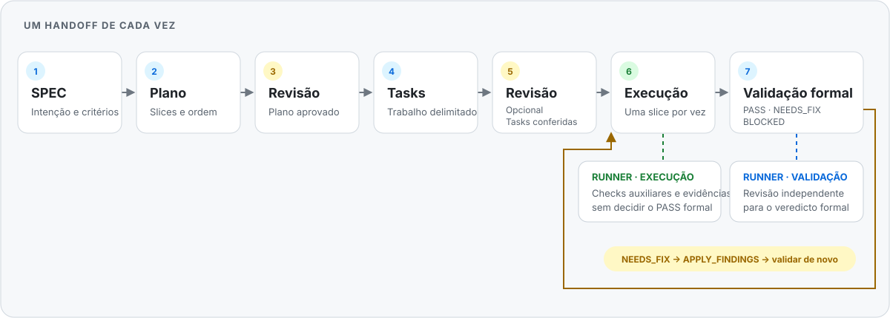

# Sentinel Workflows

## Da intenção à implementação validada

Skills de workflow e agents nativos para quem desenvolve software com **Codex** ou **Claude Code**. Sentinel organiza decisões, planejamento e evidências em etapas explícitas para que você possa acompanhar o trabalho e escolher o próximo passo.

<p align="center">
  
</p>

O desenho é uma visão geral. Cada operação termina e retorna o controle: o estado registrado indica o próximo handoff; o fluxo completo não roda automaticamente.

## Como o fluxo se organiza

1. **SPEC** — registre objetivo, escopo, critérios de aceitação e decisões em aberto com `stnl-spec-lifecycle-manager`.
2. **Plano** — decomponha o trabalho em slices com `stnl-execution-planner`.
3. **Revisão do plano** — verifique e ajuste a estratégia com `stnl-plan-reviewer` antes de criar tasks.
4. **Tasks** — materialize o trabalho aprovado com `stnl-task-materializer`.
5. **Revisão das tasks (opcional)** — confira o conjunto inicial com `stnl-task-reviewer`.
6. **Execução** — implemente uma slice com `stnl-slice-executor`. O agent `stnl-validation-runner` pode executar checks auxiliares e devolver evidências; esses checks não aprovam a slice.
7. **Validação formal** — chame `stnl-slice-quality-manager` separadamente para uma revisão independente. `NEEDS_FIX` pode levar a uma operação explícita de correção (`APPLY_FINDINGS`) e, depois, a outra validação.

O runner também pode participar da chamada formal de validação. Sua função e o resultado são diferentes em cada etapa: checks auxiliares apoiam implementação e correções; somente a validação formal emite `PASS`, `NEEDS_FIX` ou `BLOCKED`.

### Exemplo ilustrativo: adicionar histórico de compras

Imagine um pedido para permitir que clientes consultem compras anteriores. Os artefatos exatos dependem do produto e do repositório; este exemplo mostra o papel de cada etapa, sem presumir uma implementação ou resultado.

| Etapa | Exemplo do que pode ficar definido |
| --- | --- |
| SPEC | Quem consulta o histórico, quais compras aparecem, critérios de aceitação e questões como paginação ou retenção. |
| Plano | Slices ordenadas para persistência, consulta e apresentação, conforme a arquitetura existente. |
| Revisão do plano | Escopo, dependências e ordem conferidos antes de materializar trabalho. |
| Tasks | Passos concretos ligados aos critérios de aceitação e à slice aprovada. |
| Revisão das tasks | Cobertura, limites e consistência com o plano conferidos. |
| Execução | Uma slice é implementada; checks aplicáveis podem ser delegados ao runner e registrados como evidência auxiliar. |
| Validação formal | A slice é revisada de forma independente. Se houver `NEEDS_FIX`, findings podem ser corrigidos numa chamada explícita e a validação é repetida. |

## Comece aqui

### Requisitos

- Node.js 18 ou mais recente.
- Este repositório clonado localmente.
- Codex CLI e/ou Claude Code instalados e autenticados no cliente escolhido.

### Instale as skills e os agents

Na raiz deste checkout, a instalação padrão prepara os componentes Sentinel para Codex e Claude Code:

```sh
npm run sentinel:install
```

Para ver criações, substituições e remoções sem escrever:

```sh
npm run sentinel:install -- --preview
```

Para selecionar um único cliente, acrescente `--target codex` ou `--target claude`:

```sh
npm run sentinel:install -- --target codex
```

Abra um chat novo no cliente escolhido para descobrir as skills e os agents globais. Comece por `stnl-spec-lifecycle-manager`, fornecendo o caminho da SPEC e a fonte dos requisitos. Os [prompts por operação](templates/prompts/) mostram os nomes das operações e os campos a preencher; use um por vez. Operações de execução e validação também precisam do `SLICE` correspondente.

### O que a instalação altera

O instalador administra somente as pastas globais Sentinel selecionadas: `~/.codex/skills`, `~/.codex/agents`, `~/.claude/skills` e `~/.claude/agents`. Uma reinstalação substitui arquivos extras ou modificados **dentro de skills Sentinel gerenciadas** e agents Sentinel existentes; entradas Sentinel obsoletas no namespace gerenciado podem ser removidas. Use `--preview` para revisar essas ações antes de aplicá-las. Skills e agents sem relação com Sentinel, projetos consumidores e arquivos fora dessas áreas permanecem preservados.

O instalador não instala dependências nem modifica o projeto em que você usa Sentinel. Uma falha de I/O durante a aplicação informa os caminhos incompletos; não há rollback automático.

## O que este repositório contém

- `skills/workflows/` — skills de SPEC, planejamento, revisão, execução, validação e operações auxiliares.
- `skills/domains/` — orientação por domínio; fica fora do instalador de workflow.
- `agents/codex/` e `agents/claude-code/` — agents nativos distribuídos para cada cliente.
- `templates/prompts/` — entradas curtas por operação; veja também o [guia dos agents](agents/README.md).
- `scripts/sentinel-install.mjs` — prévia, comparação e instalação global.
- `benchmarks/` — avaliação e desenvolvimento do repositório; não faz parte do pacote instalado.

## Limites atuais

- Cada operação retorna ao usuário e requer um novo handoff; Sentinel não conduz o fluxo inteiro em segundo plano.
- A delegação do runner depende de o cliente seguir as instruções da skill. A aderência completa ao fluxo com runner ainda não foi certificada em ambos os clientes.
- Checks auxiliares não substituem a validação formal, revisão humana ou julgamento do mantenedor. Um resultado de implementação, por si só, não significa `PASS`.

## Verificação focada do instalador

Para executar os testes automatizados específicos do instalador:

```sh
node --test scripts/test-sentinel-install.mjs
```
